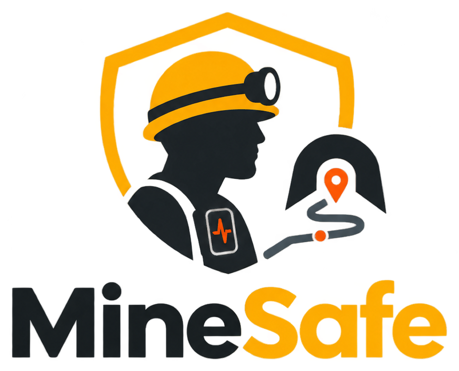
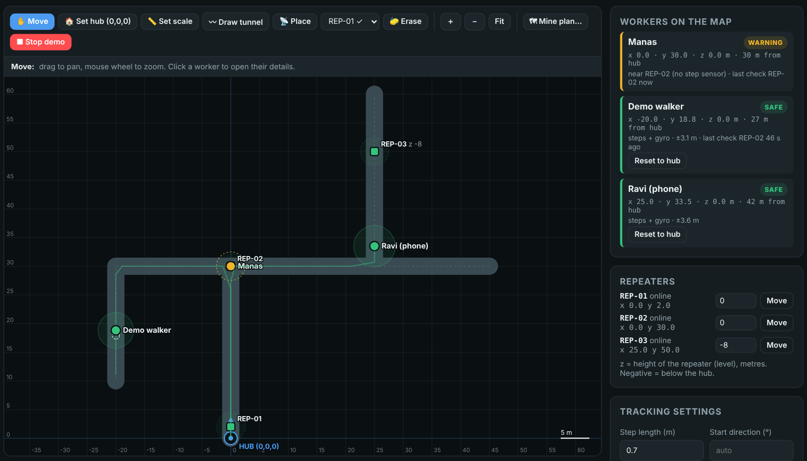
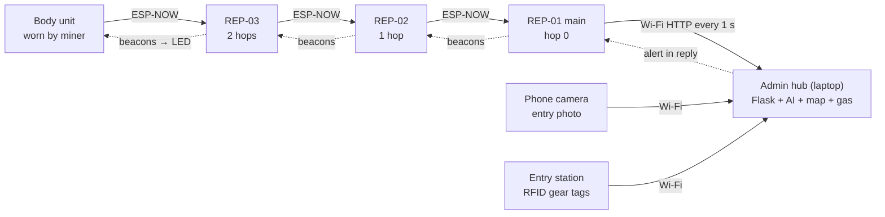
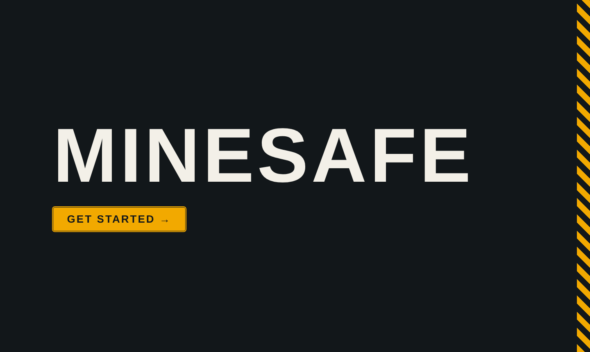
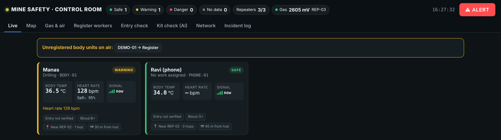
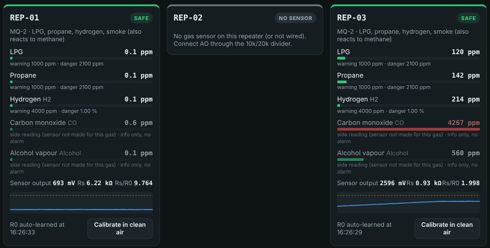
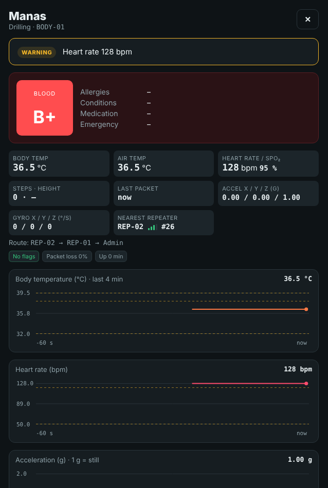

<div align="center">



**Intelligent Safety Gear Compliance, Health Monitoring and Navigation System for Miners**<br>
Capstone project · B.E. Mechanical and Mechatronics Engineering · Thakur College of Engineering and Technology (TCET), Mumbai · 2026–27

[](ROADMAP.md) [](ROADMAP.md) [-2ea44f?style=flat-square)](CHANGELOG.md)   [](LICENSE)

</div>

MineSafe checks a miner's safety kit at the gate, watches their health and movement underground, shows where they are on a tunnel map, and lets the control room warn everyone in seconds — **without GPS, internet or cabling**.



---

## The problem

In 2024 DGMS recorded **38 fatal accidents in Indian coal mines and 32 in metalliferous mines**; fall of ground, fall of person and powered haulage lead the list. Underground there is no GPS and no mobile network. The control room cannot see a worker's condition or position, kit checks at the gate are manual, and gas, falls and heat stress are usually discovered after the fact. Existing tools each solve one piece (gas detectors, RFID gates, smart helmets, CCTV PPE detection); our [competitive analysis of nine commercial products](docs/research/competitors.md) found none that combines AI kit compliance, continuous health monitoring and GPS-free location in one underground system.

## How it works



| Part | What it does |
|---|---|
| **Entry station** | XIAO ESP32-S3 Sense: RFID (NTAG215) tags on helmet, vest, pants, shoes + **built-in camera photo** (PHOTO button) + AI kit check (YOLOv8). Admin approves and pairs a body unit. Phone photo page as backup. |
| **Body unit** | ESP32-S3 N16R8 with MPU6050, BMP180, DS18B20, MAX30100/30102 (an ESP32-C6 + MPU6050 "mock" unit adds a second worker for demos). Steps, heading, fall, no movement, body temp, heart rate, SpO₂ (estimate), height, SOS button, alert LED. |
| **Repeater chain** | XIAO ESP32-C6 nodes along the tunnel relay data hop by hop over ESP-NOW. Routes form and heal by themselves. Each node has a buzzer and an MQ gas sensor. |
| **Control room** | `admin_hub.py` on a laptop: live status, tunnel map with worker dots, gas & air, worker registration with medical card, entry check, AI kit check, network health, incident log, one-click alert. |

### Location without GPS
Raw double integration of acceleration drifts by ~175 m in a minute, so MineSafe uses **pedestrian dead reckoning**: steps × step length along the gyro heading, kept inside the tunnels drawn on the map, and reset every time the worker passes close to a repeater. Pressure from the BMP180 gives the level (z). A built-in **Demo walker** shows the drift correction with no hardware.

### Detection rules (all editable)
| Event | Rule |
|---|---|
| Fall | free fall < 0.4 g and/or impact > 3 g, then lying > 55° after 2 s |
| No movement | no motion for 30 s (demo setting) |
| Body temperature | warning ≥ 38 °C, danger ≥ 39.5 °C |
| Heart rate | warning < 50 / > 120 bpm, danger < 40 / > 150 bpm |
| SpO₂ (estimate) | warning ≤ 92 %, danger ≤ 88 % |
| Gas | a sensor's main gas reaches its danger ppm → automatic alert to everyone |

## Progress

**Major versions:** [V1](docs/v1.md) Wi-Fi + cloud, no website → [V2](docs/v2.md) ESP-NOW chain + control-room website → **[V3](docs/v3.md) camera entry station + mock worker (now)** → V4 final + Zigbee

**42 / 59 tasks done · Week 9 of 14** `████████████████████░░░░░░░░░░` → full week-by-week plan, Gantt chart and checklist in **[ROADMAP.md](ROADMAP.md)**

| Version | Milestone | Status |
|---|---|---|
| v0.0 | Research, competitive analysis, architecture, pilot BOM | ✅ |
| v0.1 | Entry station reads / writes gear tags; tag registry | ✅ |
| v0.2 | Phone photo verification, body-unit clearance | ✅ |
| v0.3 | Control room v3: workers, live monitoring, alerts; entry station v2 | ✅ |
| v0.4 | Repeater chain, AI kit check, gas; Zigbee → ESP-NOW | ✅ |
| v0.5 | First end-to-end run: phone worker, body unit, alerts, buzzer | ✅ tested on hardware |
| v0.6 | Tunnel map + GPS-free tracking, gas analysis, real body sensors | ✅ software · 🔧 sensor bench test next |
| v1.0 | Structured repo, docs, presentation, Notion | ✅ |
| **V3 · v3.0** | Camera entry station (XIAO S3 Sense), mock worker, schematics, admin theme, research docs — [docs/v3.md](docs/v3.md) | ✅ software · 🔧 hardware test next |
| v4.x | Zigbee (802.15.4) network on ESP32-C6 nodes | 📋 planned |

Every version has its own branch (`version/v0.0` … `version/v1.0`) — see [CHANGELOG.md](CHANGELOG.md) for what changed and [docs/decisions.md](docs/decisions.md) for why.

## Repository layout

```
firmware/
  body_node/          body unit (worn)            – ESP32-S3 or XIAO ESP32-C6
  repeater_node/      main + tunnel repeaters     – set IS_GATEWAY / REPEATER_NO
  entry_station/      RFID gear tag station        – XIAO ESP32-C6 + PN532 + OLED
  tests/              i2c_scan, rc522_test, pn532_ntag215_test
hub/
  admin_hub.py        control room server + dashboard (Flask)
  requirements.txt
tools/
  sim_repeater.py     fake repeater chain + 3 workers (no hardware)
  mock_repeater.py    serves the repeater's phone test page on a PC
hardware/
  bom_prototype.csv   parts for the built prototype
  bom_pilot.csv       parts for the 20-worker pilot design
docs/
  v1.md v2.md v3.md  architecture.md  wiring.md  setup.md  protocol.md  decisions.md
  wiring/             schematics (SVG + PNG) and the script that draws them
  research/           literature review, competitor analysis, pilot design, original reports (source/)
  presentation/       slide outline (add the exported PDF here)
  images/             screenshots
CHANGELOG.md          version-by-version progress
ROADMAP.md            week-by-week plan and to-do list
```

## Quick start

1. **Hub (laptop)**
   ```bash
   cd hub
   pip install -r requirements.txt     # ultralytics is optional (AI kit check)
   python admin_hub.py                 # open http://localhost:5000
   ```
   No hardware yet? Run `python tools/sim_repeater.py` in a second window, or press **▶ Demo walker** on the Map tab.
2. **Firmware (Arduino IDE, ESP32 core 3.x)**
   - Copy `secrets.example.h` → `secrets.h` in `repeater_node/` and `entry_station/`, fill in your hotspot and laptop IP.
   - Board: *ESP32S3 Dev Module* or *XIAO_ESP32C6*, USB CDC On Boot: Enabled, Serial Monitor 115200.
   - Main repeater: `IS_GATEWAY 1`, `REPEATER_NO 1`. Tunnel repeaters: `IS_GATEWAY 0`, numbers 2, 3, 4 …
   - Body unit: set `BODY_ID`, stand still 3 s at power-on.
3. **Test with a phone:** join the hotspot, open `http://<repeater IP>/` — the phone acts as a worker (fall, SOS, walk on the map).

Full steps: [docs/setup.md](docs/setup.md) · Wiring + schematics: [docs/wiring.md](docs/wiring.md) · Packet format: [docs/protocol.md](docs/protocol.md) · Architecture: [docs/architecture.md](docs/architecture.md)

## Screenshots

Opening screen of the control room (press **Get started** or Enter):



| Live | Gas & air | Worker panel |
|---|---|---|
|  |  |  |

*Screens from a test run with simulated workers.*

## Bill of materials

| Build | Cost |
|---|---|
| Prototype (1 body unit, 2 repeaters, entry station; laptop + phone owned) | ≈ ₹6,500 |
| Pilot design (20 workers, 2 entry chambers, 8 UWB/LoRa repeaters, gateway, server) | ≈ ₹3,01,000 |

Approximate India-market prices, 2026. Item-by-item: [hardware/bom_prototype.csv](hardware/bom_prototype.csv) · [hardware/bom_pilot.csv](hardware/bom_pilot.csv).

## Future scope
Zigbee (802.15.4) mesh on ESP32-C6 nodes · UWB anchors for sub-metre location · LoRa backbone for long tunnels · MQ-4 / electrochemical CO and O₂ sensors · intrinsically safe enclosure · kit-removal sensing (helmet IR sensor, vest buckle reed switch, BLE tags) · OLED messages to workers · shift analytics.

## Team
| Name | Roll no. | GitHub |
|---|---|---|
| Manas Pednekar | 36 | [@Manas-36](https://github.com/Manas-36) |
| Amey Satale | 46 | [@Ameyty](https://github.com/Ameyty) |
| Aaryaa Kanojia | 18 | [@aaryaakanojia21](https://github.com/aaryaakanojia21) |

Guide: **Mr Dipesh Tare**, Assistant Professor · Full credits: [CONTRIBUTORS.md](CONTRIBUTORS.md)

## Licence
MIT — see [LICENSE](LICENSE).
