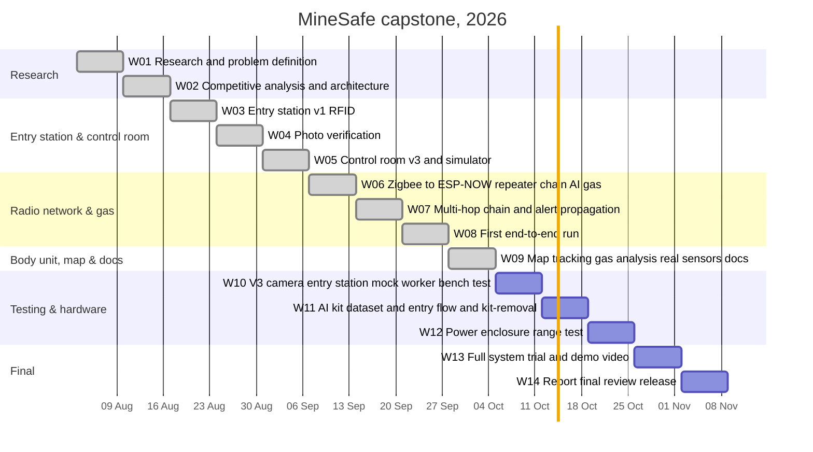
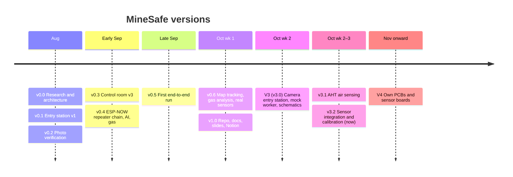

# 🗺️ MineSafe Roadmap

**Week-by-week progress of the capstone — from research to final review**

`█████████████████████░░░░░░░░░`  **42 / 59 tasks**

> Week 1 = Mon 3 Aug 2026. Weeks 1–8 dates are approximate. The same list lives in Notion as a board + timeline (*MineSafe → Project Roadmap & To-Do*); keep both in sync when a task is finished.

---

## 📊 Week by week

| | Week | Dates | Focus | Version | Progress |
|:-:|:-:|---|---|:-:|---|
| ✅ | 01 | 3 Aug – 9 Aug | 📚 Research & problem definition | `v0.0` | `██████████` 3/3 |
| ✅ | 02 | 10 Aug – 16 Aug | 🔍 Competitive analysis & architecture | `v0.0` | `██████████` 4/4 |
| ✅ | 03 | 17 Aug – 23 Aug | 🏷️ Entry station v1 (RFID) | `v0.1` | `██████████` 3/3 |
| ✅ | 04 | 24 Aug – 30 Aug | 📷 Photo verification | `v0.2` | `██████████` 2/2 |
| ✅ | 05 | 31 Aug – 6 Sep | 🖥️ Control room v3 + simulator | `v0.3` | `██████████` 4/4 |
| ✅ | 06 | 7 Sep – 13 Sep | 📡 Zigbee → ESP-NOW, repeater chain, AI, gas | `v0.4` | `██████████` 4/4 |
| ✅ | 07 | 14 Sep – 20 Sep | 🔗 Multi-hop chain + alert propagation | `v0.4` | `██████████` 3/3 |
| ✅ | 08 | 21 Sep – 27 Sep | 🎯 First end-to-end run | `v0.5` | `██████████` 4/4 |
| ✅ | **09** ◀ now | 28 Sep – 4 Oct | 🗺️ Map tracking, gas analysis, real sensors, docs | `v0.6 / v1.0` | `██████████` 13/13 |
| 🔄 | 10 | 5 Oct – 11 Oct | 🧪 V3: camera entry station, mock worker, bench test | `v3.0` | `███░░░░░░░` 2/6 |
| ⏳ | 11 | 12 Oct – 18 Oct | 🤖 AI kit dataset + entry flow + kit-removal | `v3.1` | `░░░░░░░░░░` 0/3 |
| ⏳ | 12 | 19 Oct – 25 Oct | 🔋 Power, enclosure, range test | `v3.2` | `░░░░░░░░░░` 0/3 |
| ⏳ | 13 | 26 Oct – 1 Nov | 🎬 Full system trial + demo video | `v3.3` | `░░░░░░░░░░` 0/3 |
| ⏳ | 14 | 2 Nov – 8 Nov | 🏁 Report, final review, release | `v4.0` | `░░░░░░░░░░` 0/4 |

## 🗓️ Timeline

## ✅ Tasks

📚 <b>Week 01</b> · 3 Aug – 9 Aug · Research & problem definition · <code>v0.0</code> · 3/3

- [x] Finalise problem statement and project title — Research
- [x] Literature review: ILO, DGMS, MSHA accident data and papers — Research
- [x] List required functions: kit check, health, location, gas, alerts — Research

🔍 <b>Week 02</b> · 10 Aug – 16 Aug · Competitive analysis & architecture · <code>v0.0</code> · 4/4

- [x] Competitive analysis of 9 commercial products — Research
- [x] Patent search and gap identification — Research
- [x] 7-layer system architecture — Research
- [x] Pilot BOM for 20 workers (Total_System_BOM.xlsx) — Hardware

🏷️ <b>Week 03</b> · 17 Aug – 23 Aug · Entry station v1 (RFID) · <code>v0.1</code> · 3/3

- [x] I2C scanner and PN532 NTAG215 read/write test — Entry station
- [x] Entry station v1: PN532 + OLED gear tag reader — Entry station
- [x] Hub v1: UID tag registry (admin_hub_test) — Control room

📷 <b>Week 04</b> · 24 Aug – 30 Aug · Photo verification · <code>v0.2</code> · 2/2

- [x] Hub v2: phone camera photo verification — Control room
- [x] Body-unit clearance after kit check — Control room

🖥️ <b>Week 05</b> · 31 Aug – 6 Sep · Control room v3 + simulator · <code>v0.3</code> · 4/4

- [x] Control room v3: worker registry + medical card — Control room
- [x] Live monitoring dashboard and one-click alert — Control room
- [x] Entry station v2 sends scans to hub over Wi-Fi — Entry station
- [x] Repeater simulator (sim_repeater.py) and RC522 test — Testing

📡 <b>Week 06</b> · 7 Sep – 13 Sep · Zigbee → ESP-NOW, repeater chain, AI, gas · <code>v0.4</code> · 4/4

- [x] Try Zigbee on ESP32-S3 → fails (no 802.15.4), switch to ESP-NOW — Network
- [x] Self-forming repeater chain (beacons, hop count, channel search) — Network
- [x] AI kit check with YOLOv8 (helmet, vest, shoes) — Control room
- [x] MQ gas sensor on each repeater + gas alert — Gas

🔗 <b>Week 07</b> · 14 Sep – 20 Sep · Multi-hop chain + alert propagation · <code>v0.4</code> · 3/3

- [x] Multi-hop forwarding with duplicate filter — Network
- [x] Alert travels down the chain in beacons; repeater buzzer — Network
- [x] Phone test page on repeater (phone acts as worker) — Testing

🎯 <b>Week 08</b> · 21 Sep – 27 Sep · First end-to-end run · <code>v0.5</code> · 4/4

- [x] End-to-end: phone worker → repeaters → admin hub — Testing
- [x] Fix silent buzzer (active-low / passive options) — Network
- [x] Hub auto-find when laptop IP changes — Network
- [x] Body unit v1: button + LED over ESP-NOW — Body unit

🗺️ <b>Week 09</b> · 28 Sep – 4 Oct · Map tracking, gas analysis, real sensors, docs · <code>v0.6 / v1.0</code> · 13/13 · <b>◀ now</b>

- [x] Tunnel map + GPS-free tracking (steps, heading, repeater check-points) — Location & map
- [x] Direction-aware map snapping + demo walker — Location & map
- [x] Gas & air tab: all gases in ppm per sensor, auto calibration — Gas
- [x] Body unit v2 code: MPU6050, BMP180, DS18B20, MAX3010x drivers — Body unit
- [x] Heart rate / SpO2 limits and alerts on hub — Body unit
- [x] 12–15 min presentation (22 slides) — Docs & review
- [x] Notion wiki, BOM and test log — Docs & review
- [x] Structured GitHub repo with version history v0.0 → v1.0 — Docs & review
- [x] Add guide name and branch to deck, Notion and GitHub — Docs & review
- [x] Wiring schematics for every unit (SVG + PNG) — Hardware
- [x] Admin themed like the deck + MINESAFE opening screen — Control room
- [x] Add DGMS accident statistic to the deck — Docs & review
- [x] Attach literature review document to References — Docs & review

🧪 <b>Week 10</b> · 5 Oct – 11 Oct · V3: camera entry station, mock worker, bench test · <code>v3.0</code> · 2/6

- [x] Entry station v3: XIAO S3 Sense camera + PHOTO button + /api/camphoto — Entry station
- [x] Mock worker: ESP32-C6 + MPU6050 (MOCK_MPU_ONLY) — Body unit
- [ ] Flash body unit v2 and bench-test every sensor — Body unit 🔴
- [ ] Calibrate step length and heading on a measured corridor — Location & map 🔴
- [ ] Validate fall / no-movement detection with test drops — Body unit 🔴
- [ ] Choose antenna placement (body XIAO u.FL) and log range — Hardware

🤖 <b>Week 11</b> · 12 Oct – 18 Oct · AI kit dataset + entry flow + kit-removal · <code>v3.1</code> · 0/3

- [ ] Collect reference photos and test AI kit check accuracy — Control room 🔴
- [ ] Full entry flow: RFID scan + photo + approve + pair body unit — Entry station 🔴
- [ ] Kit-removal sensing prototype (helmet IR, vest reed switch) — Body unit

🔋 <b>Week 12</b> · 19 Oct – 25 Oct · Power, enclosure, range test · <code>v3.2</code> · 0/3

- [ ] Battery + charger for body unit, measure battery life — Hardware 🔴
- [ ] Enclosures for body unit and repeaters (3D print) — Hardware
- [ ] Repeater range test along a long corridor — Network

🎬 <b>Week 13</b> · 26 Oct – 1 Nov · Full system trial + demo video · <code>v3.3</code> · 0/3

- [ ] Full trial: 3 repeaters, body unit, phone workers, gas test — Testing 🔴
- [ ] Record demo video, add photos to GitHub and Notion — Docs & review
- [ ] Fill Test Log with results — Testing

🏁 <b>Week 14</b> · 2 Nov – 8 Nov · Report, final review, release · <code>v4.0</code> · 0/4

- [ ] Write project report — Docs & review 🔴
- [ ] Final presentation rehearsal and viva questions — Docs & review 🔴
- [ ] Release v4.0 (final) on GitHub — Docs & review
- [ ] Plan Zigbee (802.15.4) migration on ESP32-C6 nodes — Network

🔴 = high priority, still open

## 🧩 By subsystem

| Subsystem | Done | Open | Progress |
|---|:-:|:-:|---|
| Research | 6 | 0 | `██████████` 100 % |
| Hardware | 2 | 3 | `████░░░░░░` 40 % |
| Entry station | 4 | 1 | `████████░░` 80 % |
| Control room | 7 | 1 | `█████████░` 88 % |
| Testing | 3 | 2 | `██████░░░░` 60 % |
| Network | 6 | 2 | `████████░░` 75 % |
| Gas | 2 | 0 | `██████████` 100 % |
| Body unit | 4 | 3 | `██████░░░░` 57 % |
| Location & map | 2 | 1 | `███████░░░` 67 % |
| Docs & review | 6 | 4 | `██████░░░░` 60 % |

## 🏷️ Versions

Each finished stage is a `version/*` branch — see [CHANGELOG.md](CHANGELOG.md).

Manas Pednekar · Amey Satale · Aaryaa Kanojia · Guide: Mr Dipesh Tare, Assistant Professor Mechanical and Mechatronics Engineering · TCET Mumbai · 2026–27

