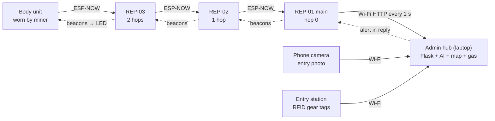
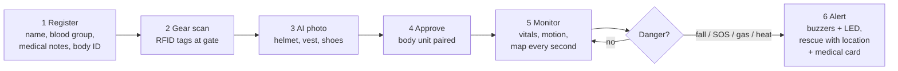

# Architecture

## Data and alert paths

- **Up:** a body unit broadcasts one 54-byte packet per second; every repeater that hears it forwards it toward the main repeater (fewest hops), which posts all packets to the hub every second.
- **Down:** the hub's HTTP reply carries the alert (`id`, `level`, `target`). Repeaters adopt any newer alert ID and repeat it in their beacons, so every buzzer sounds and every body LED lights.

## Worker journey

## Self-forming repeater chain
- Every repeater beacons once a second: number, hops to the main repeater, radio channel, current alert.
- Each repeater picks the neighbour with the fewest hops (signal ≥ −92 dBm) as its parent; routes form and heal on their own.
- A repeater or body unit that hears nothing for 8 s scans channels 1–13 and rejoins; the chain follows the hotspot's Wi-Fi channel.

## GPS-free location (hub side)
1. Steps × step length along the gyro heading (heading = rotation about the gravity vector).
2. Map matching: the tunnel that runs the way the worker walks wins over a closer crossing one; tunnel direction slowly corrects gyro drift.
3. Repeater check-points: strong signal (≥ −55 dBm) = within a few metres → error resets.
4. Height from BMP180 pressure (z).

## Software
| Component | Language | Notes |
|---|---|---|
| `firmware/body_node` | Arduino C++ (ESP32 core 3.x) | sensor drivers written in-house, no libraries |
| `firmware/repeater_node` | Arduino C++ | ESP-NOW chain, HTTP uplink, phone test page, gas |
| `firmware/entry_station` | Arduino C++ | Adafruit PN532 / SSD1306 / GFX |
| `hub/admin_hub.py` | Python 3, Flask | dashboard in one file; optional `ultralytics` for AI |
