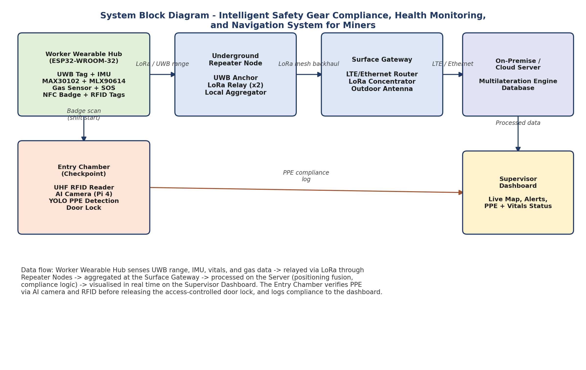
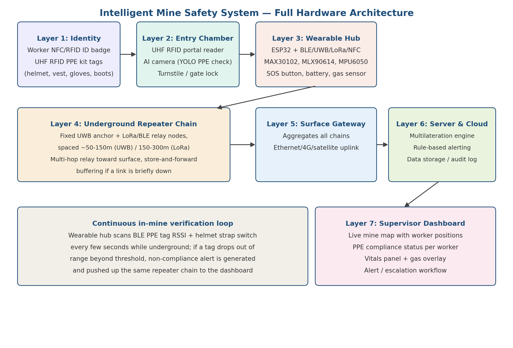
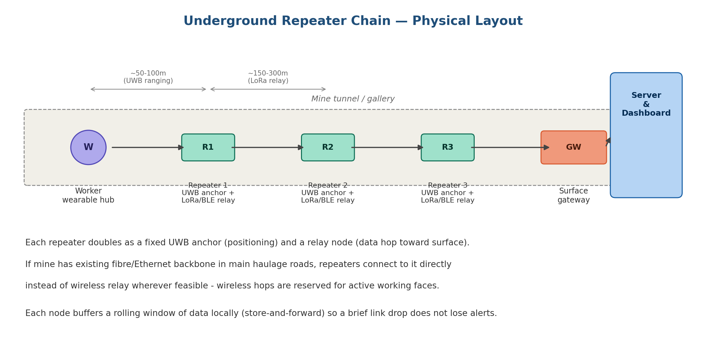
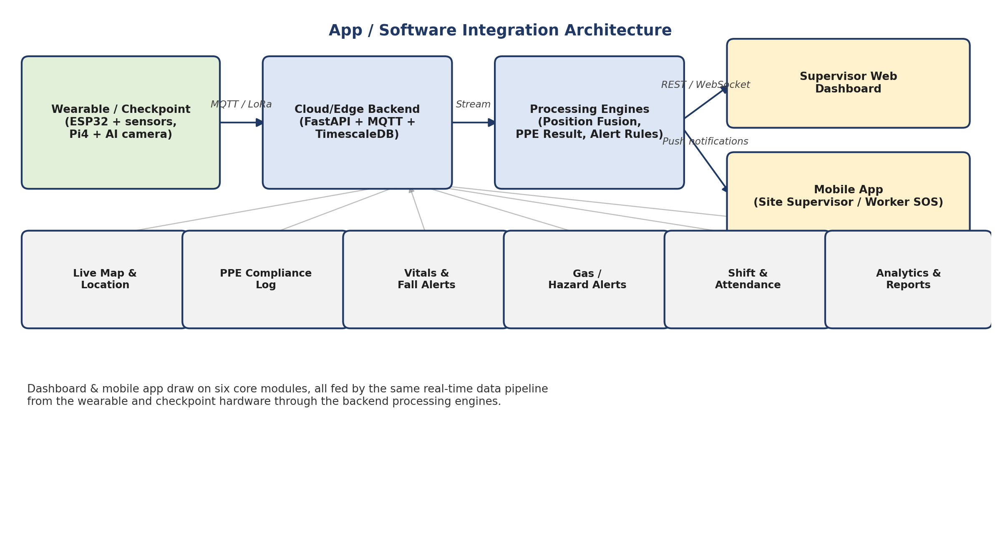

# Pilot design (full-scale architecture)

The design the team prepared before building (Week 3 block diagram, *Hardware Architecture & BOM*, *Presentation Brief*). The prototype in this repo implements the same layers with lower-cost parts — see [`../decisions.md`](../decisions.md).

## Seven layers

| Layer | Pilot design | Prototype (built) |
|---|---|---|
| 1 Identity | Worker NFC badge (NTAG213/215), UHF RFID tags in helmet, vest, gloves, boots | NTAG215 tags on helmet, vest, pants, shoes |
| 2 Entry chamber | UHF portal reader, Pi 4 + Camera 3 running YOLO, 12 V solenoid lock | XIAO C6 + PN532 + OLED; phone camera + YOLOv8 on laptop; admin approves |
| 3 Wearable hub | ESP32 + DW3000 UWB + MPU6050 + MAX30102 + MLX90614 + SX1262 LoRa + PN532 + BLE PPE scan + chin-strap switch + SOS | ESP32-S3 / XIAO C6 + MPU6050 + BMP180 + DS18B20 + MAX3010x + SOS + LED |
| 4 Repeater chain | UWB anchor + 2× LoRa relay + ESP32/Pi, IP66/ATEX enclosure, 50–100 m spacing | ESP32 ESP-NOW self-forming chain + buzzer + MQ gas |
| 5 Surface gateway | Teltonika RUT956 4G router / LoRa concentrator | Main repeater on the Wi-Fi hotspot |
| 6 Server | Intel NUC, multilateration, rule engine, audit log | Flask hub on a laptop, dead reckoning + rules + logs |
| 7 Dashboard | React web app + mobile app, WebSocket, push / SMS | Single-page dashboard served by the hub |

## Entry chamber logic (pilot)
1. NFC badge read → 2–3 s assignment window.
2. UHF portal scans every PPE tag in that window.
3. Server links the tag set to the worker for the shift.
4. Camera runs YOLO: which items are visibly *worn*.
5. RFID and camera agree → gate unlocks; disagree (e.g. helmet tag present but not on the head) → gate holds, supervisor alerted.
6. Poor light → RFID-only, logged as **unverified**.
7. Re-entry in the same shift reuses the last verified set unless tags change.

## Repeater chain

Each node is both a UWB anchor (ranging) and a relay (forwards ID, vitals, PPE flag, gas, alerts). Use the mine's fibre/Ethernet backbone where it exists; wireless hops only near the working face.

## End-to-end data flow
| Stage | Data | Protocol |
|---|---|---|
| Badge → chamber reader | Worker ID | NFC 13.56 MHz |
| PPE tags → chamber portal | PPE UIDs | UHF RFID 860–960 MHz |
| Chamber → server | Worker ID + tag set + camera result | Ethernet / Wi-Fi |
| PPE tags → wearable | UIDs + RSSI | BLE 5.0 |
| Wearable → repeater 1 | ID, vitals, PPE flag, ranging, alerts | UWB + LoRa / BLE |
| Repeater n → n+1 | Aggregated payloads, buffered | LoRa or Ethernet |
| Gateway → server | Everything | Ethernet / 4G / satellite |
| Server → dashboard | Positions, vitals, compliance, alerts | HTTPS / WebSocket |

## Indicative costs (mid-2026, India)
| Unit | Approx. cost |
|---|---|
| Per worker (hub + tags) | ₹3,900 – 6,400 (UWB module is the largest item) |
| Per entry chamber | ₹29,000 – 72,000 (UHF portal reader is the largest item) |
| Per repeater node | ₹3,100 – 12,000 |
| Pilot: 1 section, ~10 workers, 5–8 repeaters, 1 chamber | ₹1.2 – 2.5 lakh (excl. server, firmware time, certification) |
| Full pilot: 20 workers, 2 chambers, 8 repeaters, gateway, server | ≈ ₹3,01,000 — [`source/Total_System_BOM.xlsx`](source/Total_System_BOM.xlsx), [`../../hardware/bom_pilot.csv`](../../hardware/bom_pilot.csv) |

## Software (planned stack vs built)

| Layer | Planned | Built |
|---|---|---|
| Wearable firmware | Arduino / ESP-IDF, MQTT over Wi-Fi / LoRa | Arduino C++, ESP-NOW, 54-byte packet |
| Edge AI | TensorFlow Lite YOLO on Pi 4 + OpenCV | Ultralytics YOLOv8 on the laptop |
| Backend | FastAPI + Mosquitto/EMQX + TimescaleDB | Flask, JSON files |
| Position engine | Kalman UWB + IMU fusion | Step + heading dead reckoning, map matching, repeater check-points |
| Dashboard | React + WebSocket + Leaflet; React Native / Flutter app | Vanilla JS dashboard, 1 s polling, SVG tunnel map |
| Alerts | Firebase push + Twilio SMS | Buzzers on every repeater, body LED, on-screen alerts |

Planned dashboard modules: live map, PPE compliance log, vitals + fall/SOS, gas alerts, shift & attendance, analytics & reports, admin panel.

## Implementation notes (from the hardware report)
- Power is the tightest constraint: duty-cycle radios, deep sleep between polls, 8 h+ shift.
- Gassy coal mines need intrinsically safe / ATEX enclosures; metal mines can pilot with IP66/67.
- UWB accuracy depends on surveyed anchor positions; re-survey after tunnel changes.
- Fail safe and loud: unverified PPE is logged as unverified; dropped hops buffer and alert.
- Pilot one section first to validate spacing, battery life and false-positive rates.
