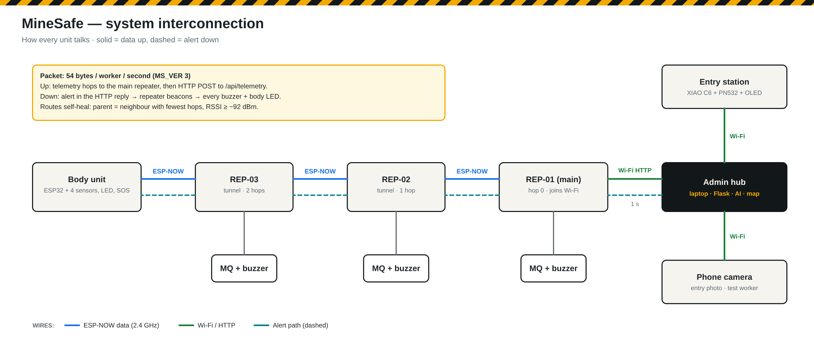
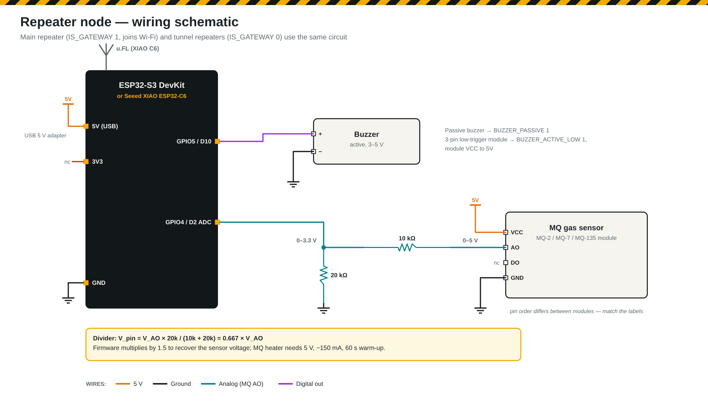
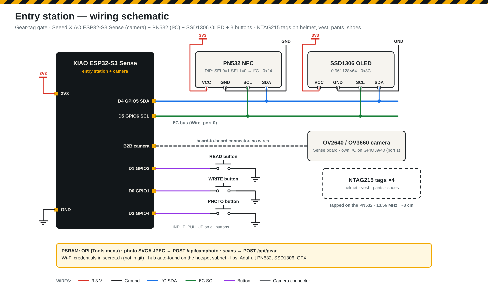

# MineSafe V3 (v3.0 – v3.2)

> **Status (5 Oct 2026): calibrating — V3 is not complete yet.** We are integrating and calibrating the sensors board by board: body unit on the ESP32-C6-WROOM-1 DevKit, entry station on the XIAO ESP32-S3 Sense with the PN532 RFID antenna and camera. Next major version: **[V4 — our own PCBs and sensor boards](v4.md)**.

**Camera entry station · mock worker · same ESP-NOW network** — released 4 Oct 2026.
Previous: [V1](v1.md) · [V2](v2.md) · Branch: [`version/v3.0`](https://github.com/Manas-36/MINESAFE/tree/version/v3.0) · changes: [CHANGELOG](../CHANGELOG.md) · why ESP-NOW now and Zigbee later: [decision 13](decisions.md)



## Hardware in V3
```
S3 body unit ─┐
C6 mock unit ─┼─ ESP-NOW ─► XIAO C6 repeaters ─► main XIAO C6 ─ Wi-Fi ─► Hub (laptop)
Phone worker ─┘                                                            ▲
XIAO S3 Sense entry station (RFID + camera) ─────────── Wi-Fi ─────────────┘
```

| Device | Board | Firmware | Key settings |
|---|---|---|---|
| Body unit | ESP32-S3 N16R8 | `firmware/body_node` | `BODY_ID "BODY-01"`, `MOCK_MPU_ONLY 0` · board *ESP32S3 Dev Module* |
| Mock worker | ESP32-C6 + MPU6050 | `firmware/body_node` | `BODY_ID "BODY-02"`, **`MOCK_MPU_ONLY 1`** · board *XIAO_ESP32C6* / *ESP32C6 Dev Module* |
| Main repeater | XIAO ESP32-C6 | `firmware/repeater_node` | `IS_GATEWAY 1`, `REPEATER_NO 1`, `secrets.h` |
| Tunnel repeaters | XIAO ESP32-C6 | `firmware/repeater_node` | `IS_GATEWAY 0`, `REPEATER_NO 2, 3, …` |
| Entry station | XIAO ESP32-S3 Sense | `firmware/entry_station` | `secrets.h` · board *XIAO_ESP32S3* · **PSRAM: OPI PSRAM** |
| Phone | any | repeater test page `http://<repeater IP>/` | — |
| Hub | laptop | `hub/admin_hub.py` | `python admin_hub.py` |

All boards: Arduino ESP32 core 3.x, *USB CDC On Boot: Enabled*, Serial Monitor 115200.

## What changed from V2
| Part | V2 | V3 |
|---|---|---|
| Entry station | XIAO C6 + PN532 + OLED, photo from a phone | **XIAO S3 Sense** + PN532 + OLED + **PHOTO button** — built-in camera sends the photo itself (phone page kept as backup) |
| Hub | phone photo upload | + **`/api/camphoto`** (raw JPEG from the station) → verification card + AI kit check; verdict returned to the OLED |
| Body unit | one worker | + **mock worker** (`MOCK_MPU_ONLY`, flag `BF_NO_VITALS = 256`) — second dot on the map, no sensor-fault warnings |
| Repeaters | ESP32-S3 / C6 | **XIAO C6** — firmware unchanged |
| Network | ESP-NOW | ESP-NOW |
| Docs | — | schematics for every unit, research reports, accident case list, deck theme on the admin page |

## Repeater (XIAO C6) — + AHT air sensor in v3.1


| Part | Pin |
|---|---|
| Buzzer + (− → GND) | D10 (GPIO18) |
| MQ gas AO → 10 kΩ → D2, D2 → 20 kΩ → GND (module VCC 5 V) | D2 (GPIO2) |
| **AHT10/20/25 VCC → 3V3, GND → GND** | 3V3 / GND |
| **AHT SDA** | **D4 (GPIO22)** |
| **AHT SCL** | **D5 (GPIO23)** |
| External antenna | u.FL socket → `USE_EXTERNAL_ANTENNA 1` |

Checks: Serial shows `AHT air sensor on SDA GPIO22 / SCL GPIO23: found` and `ESP-NOW OK buzzer GPIO18`; type `a` for an air reading, `b` for a 1 s buzzer test (silent → try `BUZZER_ACTIVE_LOW 1` or `BUZZER_PASSIVE 1`); power the main repeater first, the Network tab should show 3/3.

**Air in the admin (v3.1):** every repeater card on *Gas & air* gets an **Air · AHT sensor** panel with temperature, humidity, wet-bulb temperature and a 5-minute graph; the *Network* tab has an **Air (AHT)** column; the top bar shows the hottest repeater. Heat level: wet-bulb ≥ 30.5 °C warning, ≥ 33.5 °C danger (the limits in Indian mine regulations), air ≥ 35 °C or humidity ≥ 90 % warning. Level changes go to the *Incident log*. No sensor → "NO SENSOR" with the pins to check.

## Entry station (XIAO ESP32-S3 Sense)


| Connection | Pin |
|---|---|
| PN532 + OLED SDA / SCL | D4 (GPIO5) / D5 (GPIO6) |
| READ button → GND | D1 (GPIO2) |
| WRITE button → GND | D0 (GPIO1) |
| **PHOTO button → GND** | **D3 (GPIO4)** |
| Camera | Sense expansion board (no wires) |

**Entry flow**
1. Worker taps helmet, vest, pants and shoes tags → each shows SUCCESS + admin verdict.
2. **PHOTO** → 3-2-1 countdown → photo + scanned tags sent to the hub → OLED shows the AI verdict.
3. Hub *Entry check* tab → type the worker name, pick the body unit (BODY-01) → **Approve** → body unit paired.

Boot check: Serial prints **`Camera OK (SVGA, PSRAM)`**. If camera init fails: PSRAM must be *OPI PSRAM*, camera ribbon fully seated. If the laptop IP changed, the station finds the hub on the hotspot subnet by itself.

## Mock worker (ESP32-C6 + MPU6050)
MPU6050 SDA → GPIO22 (D4), SCL → GPIO23 (D5), VCC → 3V3, GND → GND. Button GPIO19 and LED GPIO18 optional. Keep still 3 s at power-on.

## Body unit (ESP32-S3 N16R8)
Unchanged from V2 — wiring: [body unit schematic](wiring/body_unit.png).

## Verified
- Builds: `body_node` (ESP32-S3, XIAO C6, C6 mock), `entry_station` (XIAO S3 Sense with camera, XIAO C6 without), `repeater_node` with AHT (XIAO C6, ESP32-S3).
- Hub (v3.1): air temperature / humidity from each repeater shown and logged; hot + humid repeater turns DANGER; unplugged sensor shows NO SENSOR (tested with the simulator).
- Hub: `/api/camphoto` accepts a JPEG, links the scanned tag, rejects non-JPEG data.
- Not yet on hardware: camera capture on the S3 Sense, mock worker walking on the map.

## Calibration checklist (v3.2, in progress)
| Board | Check | Status |
|---|---|---|
| Body unit (C6-WROOM-1 DevKit) | Serial output on both sockets | ✅ |
| | HW-827 pulse on GPIO2 | ✅ reading |
| | MPU6050 + BMP180 on I²C (GPIO6 / 7) | 🔧 not answering — wiring check (`body_sensor_test`, `f`) |
| | DS18B20 on GPIO10 | 🔧 not answering — rail / 4.7 kΩ check |
| | Button GPIO18, LED GPIO19 | ⏳ |
| Entry station (XIAO S3 Sense) | PN532 + OLED + buttons | ⏳ `entry_hw_test` |
| | Camera photo | ⏳ `entry_hw_test` web page |
| Repeaters (XIAO C6) | Chain, buzzer, MQ gas, AHT air | ✅ bench |
| Whole system | Fall / steps / heart rate calibrated against real walks | ⏳ |

## Next
Finish calibration · AI kit dataset of our own kit · range test · full trial + demo video → then **[V4: our own PCBs and sensor boards](v4.md)**.
