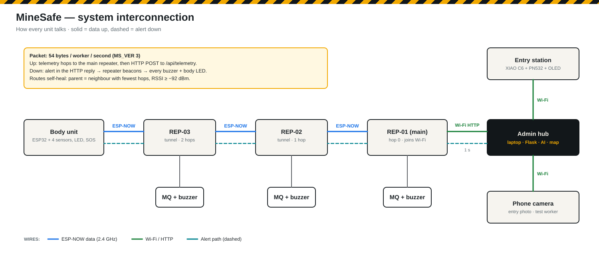
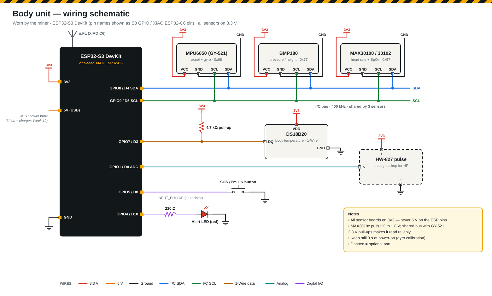
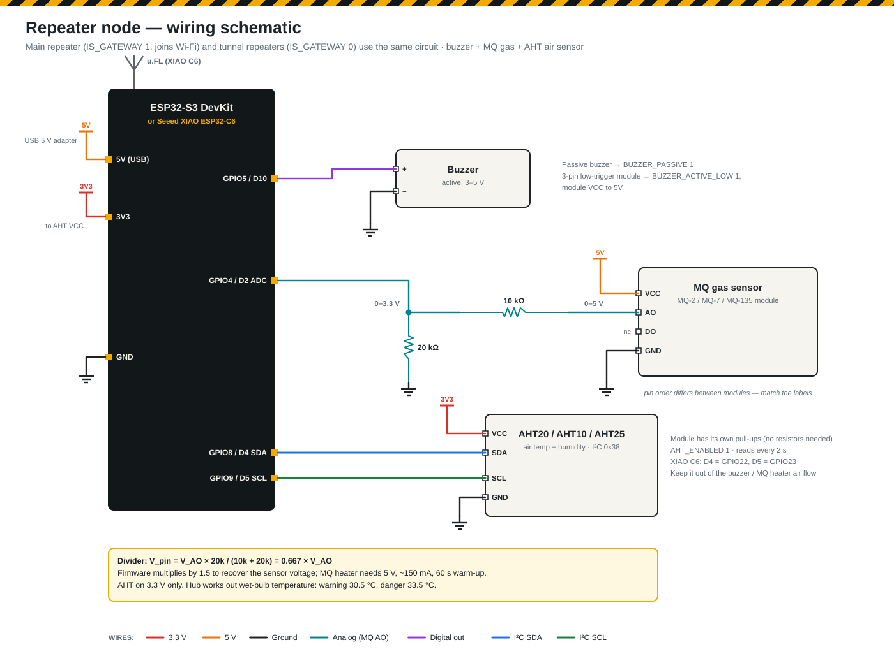
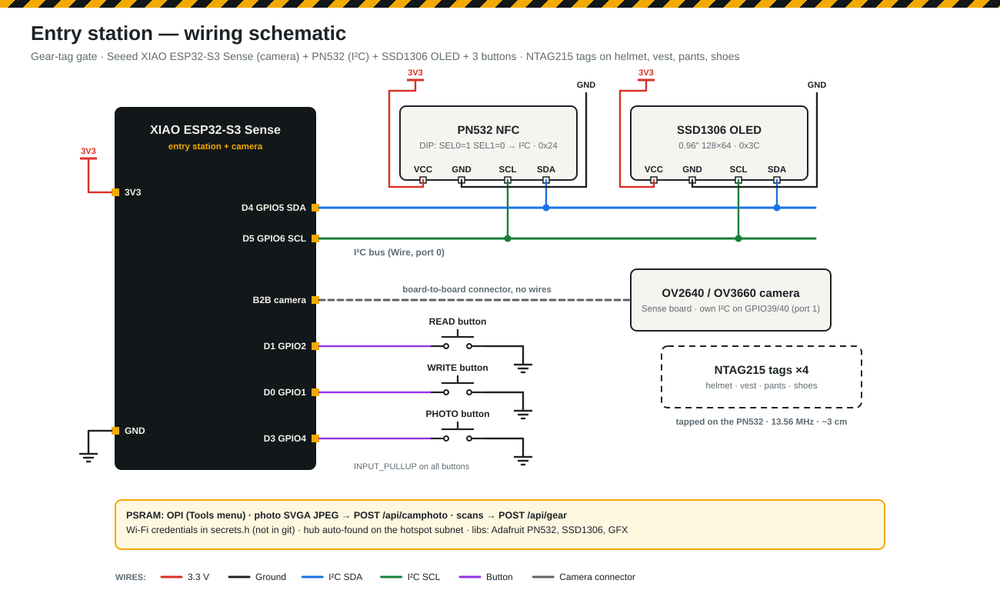

# Wiring

Schematics are generated from `docs/wiring/make_schematics.py` (run it after changing a pin). SVG = sharp/zoomable, PNG = for slides, Notion and the report.

## System interconnection

## Body unit

## Body unit

| Connection | ESP32-S3 | XIAO ESP32-C6 |
|---|---|---|
| I2C SDA — MPU6050, BMP180, MAX3010x (all in parallel) | GPIO8 | D4 |
| I2C SCL — same three | GPIO9 | D5 |
| Sensor VCC/VIN, GND | 3V3, GND | 3V3, GND |
| DS18B20 data (red → 3V3, black → GND) + **4.7 kΩ data → 3V3** | GPIO7 | D3 |
| HW-827 pulse sensor S (+ → 3V3, − → GND) | GPIO4 | D0 |
| SOS button (other leg → GND) | GPIO5 | D8 |
| Red LED via 220 Ω (LED − → GND) | GPIO6 | D10 |

I2C addresses: MPU6050 `0x68`, BMP180 `0x77`, MAX30100/30102 `0x57`.
The green MAX3010x board pulls its I2C lines to 1.8 V; sharing the bus with the GY-521 (3.3 V pull-ups) usually makes it read reliably.

## Repeater

| Connection | ESP32-S3 | XIAO ESP32-C6 |
|---|---|---|
| Buzzer + (− → GND) | GPIO5 | D10 (GPIO18) |
| MQ gas AO → 10 kΩ → pin, pin → 20 kΩ → GND (module VCC → 5 V) | GPIO4 | D2 |
| **AHT10/20/25 VCC** | 3V3 | 3V3 |
| **AHT GND** | GND | GND |
| **AHT SDA** | GPIO8 | D4 (GPIO22) |
| **AHT SCL** | GPIO9 | D5 (GPIO23) |
| External 2.4 GHz antenna (u.FL → SMA pigtail) | — | u.FL, `USE_EXTERNAL_ANTENNA 1` |

The 10 k / 20 k divider keeps the 0–5 V MQ output safe for the 3.3 V pin; the code multiplies by 1.5 to undo it.

**AHT air sensor (v3.1).** Any AHT10 / AHT20 / AHT21 / AHT25 module at I²C address 0x38; the module's own pull-ups are enough, power it from **3V3 only**. `AHT_ENABLED 1` in `repeater_node.ino` reads it every 2 s (driver written in the sketch, no library). The hub shows air temperature, humidity and the worked-out **wet-bulb** temperature on the *Gas & air* and *Network* tabs: warning at 30.5 °C wet-bulb, danger at 33.5 °C, also warning above 35 °C air or 90 % RH. Mount the sensor away from the MQ heater and the board's regulator, which warm the air around them.

## Full body unit on the ESP32-C6-WROOM-1 DevKit
Board *ESP32C6 Dev Module*. `body_node.ino` picks these pins by itself on that board (the XIAO C6 keeps its own pins). Check the sensors first with `firmware/tests/body_sensor_test`.

| Part | ESP32-C6-WROOM-1 DevKit |
|---|---|
| MPU6050 + BMP180 + MAX3010x SDA | GPIO6 |
| MPU6050 + BMP180 + MAX3010x SCL | GPIO7 |
| I²C sensors VCC / GND | 3V3 / GND |
| DS18B20 data (4.7 kΩ to 3V3) | GPIO10 |
| HW-827 S (analog) | GPIO2 |
| SOS button (→ GND) | GPIO18 |
| Red LED (220 Ω) | GPIO19 |

Avoid GPIO8 (on-board RGB LED), GPIO9 (BOOT), GPIO4/5/15 (strapping) and GPIO12/13 (USB). Only GPIO0–6 read analog on the C6.

## Mock body unit (ESP32-C6 + MPU6050)
An extra worker for the map demo. Flash `body_node` with `BODY_ID "BODY-02"` and `MOCK_MPU_ONLY 1`; only the MPU6050 is wired (same pins as the body unit's C6 column: SDA GPIO22 / D4, SCL GPIO23 / D5, VCC 3V3, GND). Button (GPIO19) and LED (GPIO18) are optional. The hub shows it as a motion-only worker — no temperature or heart-rate warnings.

## Mock body unit 2 (ESP32-C6 DevKit + DS18B20)
A temperature-only demo worker. Flash `body_node` with `BODY_ID "BODY-02"`, `MOCK_TEMP_ONLY 1`, `DS18B20_PIN_CUSTOM 10`; board *ESP32C6 Dev Module*.

| DS18B20 | ESP32-C6 DevKit |
|---|---|
| Red (VDD) | 3V3 |
| Black (GND) | GND |
| Yellow (data) | GPIO10 |
| 4.7 kΩ | between GPIO10 and 3V3 |

The hub shows its temperature and gives no motion-sensor warning (flag `BF_NO_MOTION = 512`).

## Entry station / scanning system (ESP32-C6)
From v3.2 the scanning system runs on an **ESP32-C6** (no camera — the entry photo is taken on the phone page `http://<laptop-ip>:5000/phone` and matched with the scanned tags on the hub). Check it first with `firmware/tests/entry_hw_test`.

| Connection | ESP32-C6-WROOM-1 DevKit | XIAO ESP32-C6 |
|---|---|---|
| PN532 + SSD1306 OLED VCC / GND | 3V3 / GND | 3V3 / GND |
| PN532 + OLED SDA | GPIO6 | D4 (GPIO22) |
| PN532 + OLED SCL | GPIO7 | D5 (GPIO23) |
| READ button (→ GND) | GPIO18 | D1 |
| WRITE button (→ GND) | GPIO19 | D0 |
| PHOTO button (→ GND, optional) | GPIO20 | D3 |
| PN532 DIP switch | I2C: 1 ON, 2 OFF | same |

**PN532 module: HW-147C** (red PN532 NFC V3 board). Use the **4-pin header** (GND, VCC, SDA, SCL); the 8-pin SPI header (IRQ, RSTO …) stays empty. DIP switch for I2C: **switch 1 ON, switch 2 OFF** (HSU = both OFF, SPI = 1 OFF / 2 ON) — set it with the power off. Power it from **3V3** so the I²C lines stay at 3.3 V. Address **0x24**; tags read within ~3–5 cm of the antenna (the white coil area).

Libraries: *Adafruit PN532*, *Adafruit SSD1306*, *Adafruit GFX* (+ *Adafruit BusIO*).

## Entry station (XIAO ESP32-S3 Sense, earlier V3 option with camera)

| Connection | XIAO S3 Sense | (XIAO C6, no camera) |
|---|---|---|
| PN532 + SSD1306 OLED SDA | D4 (GPIO5) | D4 |
| PN532 + OLED SCL | D5 (GPIO6) | D5 |
| READ button (→ GND) | D1 (GPIO2) | D1 |
| WRITE button (→ GND) | D0 (GPIO1) | D0 |
| **PHOTO button (→ GND)** | **D3 (GPIO4)** | D3 |
| Camera | Sense expansion board (B2B connector) | — |
| VCC / GND | 3V3 / GND | 3V3 / GND |

Arduino: board **XIAO_ESP32S3**, **PSRAM: OPI PSRAM**. Libraries: Adafruit PN532, Adafruit SSD1306, Adafruit GFX. PN532 DIP switches set to I2C. The camera uses its own I²C bus (GPIO39/40, port 1), so it does not clash with the PN532 / OLED bus.
